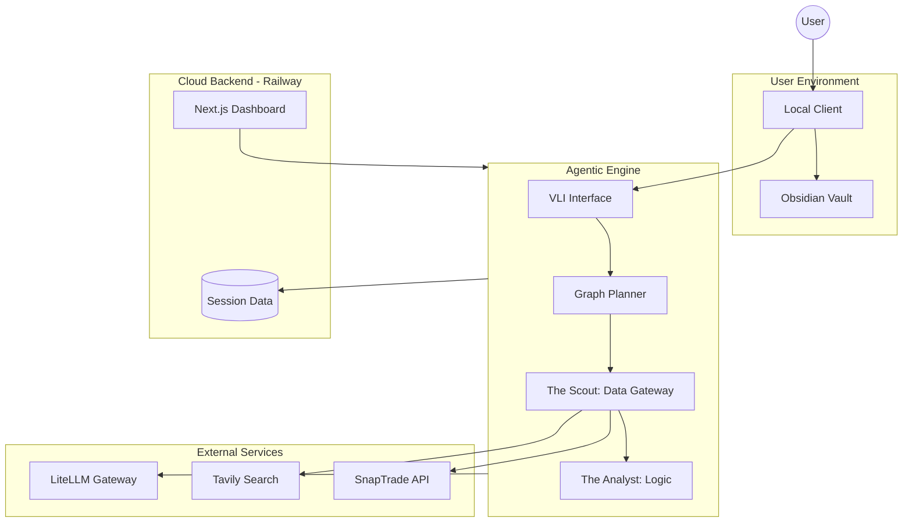

# Component Diagram: Cobalt Multiagent (CMA)

This diagram illustrates the high-level system components and their external dependencies for the Project Cobalt agentic framework.

### Role of Key Components:

1.  **User Environment**: Local persistence using the **Obsidian** knowledge hub. Dispatches are indexed as Markdown files.
2.  **Cloud Backend**: The containerized Python environment running **LangGraph** workflows and the Next.js management dashboard.
3.  **External Services**: Direct-to-source data retrieval (**SnapTrade**), contextual market search (**Tavily**), and multi-model LLM reasoning via **LiteLLM**.
