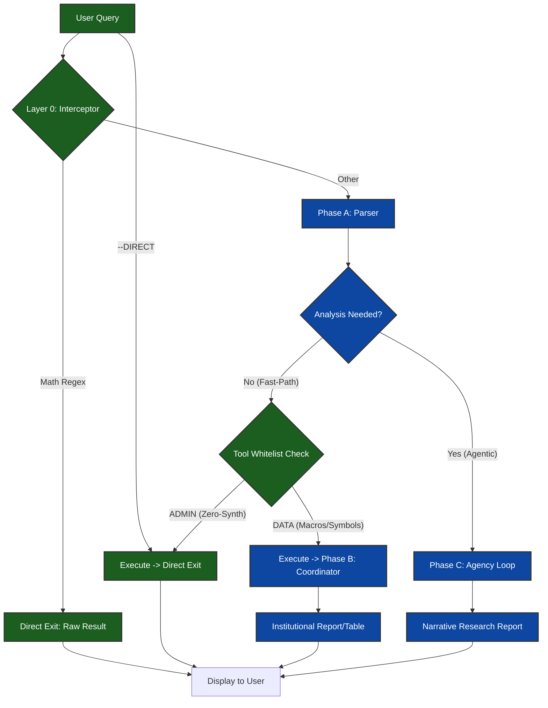

# Implementation Plan: VLI Math & System Hardening (Final)

This plan finalizes the tiered architecture for ultra-low latency queries in the VLI Spine. It provides absolute fast-paths for math/admin tasks while maintaining the high-fidelity synthesis standard for all financial data (including Macro symbols).

## Tiered Workflow Visualization

## Proposed Changes

### 1. Tiered Execution Architecture

#### [MODIFY] [vli.py](file:///c:/github/cobalt-multi-agent/backend/src/graph/nodes/vli.py)

| Layer | Type | Mechanism | Latency | Result Style |
| :--- | :--- | :--- | :--- | :--- |
| **Layer 0** | Arithmetic / Overrides | Regex & Flag Interceptor at Spine Top | < 100ms | Raw Text |
| **Layer 1** | Algebra / Admin Tasks | Parser Early-Exit with **Zero-Synthesis** | ~1.5s | Raw Status / Answer |
| **Layer 2** | Fast-Path Data | Parser -> Tools -> **Coordinator Synthesis** | ~5.0s | Institutional Table |
| **Layer 3** | Complex Research | Full Agentic Graph (Scout -> Specialists) | ~11.0s | Narrative Report |

*   **Logic Updates**:
    *   **Layer 1 (Zero-Synthesis)**: Create an `ADMIN_DIRECT_TOOLS` whitelist ([`vli_cache_tick`, `clear_vli_diagnostic`, `invalidate_market_cache`]).
    *   If `intent == "EXECUTE_DIRECT"` and tool calls are in this whitelist, return the result **immediately** after tool execution, skipping Phase B synthesis.
    *   **Layer 2 (Financial Fast-Path)**: Tools like `get_macro_symbols` and `get_stock_quote` are NOT in the `ADMIN_DIRECT_TOOLS` whitelist. They will hit the `Fast-Path Bypass` and proceed to the **Coordinator** (L260) to ensure a professional institutional table is generated.

### 2. Prompt & Schema Stabilization

#### [MODIFY] [parser.md](file:///c:/github/cobalt-multi-agent/backend/src/prompts/parser.md)
*   **Intent Definitions**:
    *   `EXECUTE_DIRECT`: Math, Algebra, and Administrative sync only.
    *   `MARKET_INSIGHT`: All pricing, macros, tickers, and analysis.
*   **Instructions**: "Macro symbol requests should be handled like standard ticker requests. Use `MARKET_INSIGHT` and invoke the appropriate tool."

## Verification Plan

### Automated Benchmark
- **Math Bypass**: "5 + 10" -> [x] Verify < 100ms.
- **Admin Direct**: "Clear diagnostics --DIRECT" -> [x] Verify < 2s (Zero Synthesis).
- **Macro Fast Path**: "Get macros" -> [x] Verify ~5s (Final output is a professional report/table).

### Manual Verification
- Test "Get macros" on the VLI Dashboard. Confirm it renders a full synthesis report, while "5 + 5" renders a simple result string.
