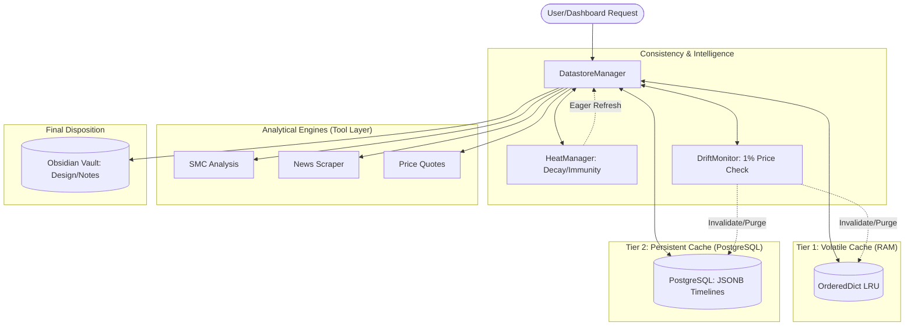

# Master Design: VLI Hybrid Caching & Persistent Storage

This document consolidates all current design decisions and proposals for the Cobalt Multiagent caching architecture. It serves as the single source of truth for the upcoming implementation phase.

---

## 1. System Overview
The VLI system will move from a purely volatile "best effort" cache to a **Dual-Layer Consistency Architecture**. This ensures fast user resonance while maintaining the integrity of expensive analytical reports across sessions.

### Architectural Blueprint


---

## 2. Tiered Storage Strategy (Hybrid Approach)
*Proposed on 2026-04-11 - **APPROVED***
- **Primary Storage**: Python Dictionaries in `shared_storage.py`.
- **Target Data**: High-frequency price quotes, real-time OHLCV metrics, and transient session flags.
- **Eviction Policy**: TTL + LRU Cap.

### Tier 2: Persistent Offline Storage (PostgreSQL)
*Proposed on 2026-04-11 - **APPROVED***
- **System**: PostgreSQL (Managed service via Railway recommended).
- **Security**: SSL/TLS encryption + Role-Based Access Control (RBAC).
- **Target Data**: 
  - News Feeds & Scraped Articles (Stored as JSONB timelines).
  - SMC Analysis Reports (Technically expensive, stored as TEXT/JSONB).
  - Web Search Result Summaries.
- **Performance Tuning**: Cache-specific tables will use `UNLOGGED` settings to maximize write IOPS by skipping the Write-Ahead Log (WAL).
- **Persistence**: Survives backend restarts and user session timeouts.

---

> [!IMPORTANT]
> ## NEW: Capacity & Performance Constraints (Symbol-Level LRU)
> *Proposed on 2026-04-11 - **APPROVED***
> 
> To prevent memory leaks and ensure fair distribution of resources:
> 1. **Symbol-Level Cap**: The cache will be strictly limited to **1,000 unique symbols**.
> 2. **Nested Structure**: Each symbol entry acts as a "Container" for all its timeframes (1m, 1h, 1d, etc.).
> 3. **Heat-Based Immunity**: The top **20 symbols** (Ranked by "Reference Heat") are **immune to eviction**. They will never be purged to make room for new symbols unless their heat rank falls.
> 4. **LRU Eviction**: When a 1,001st symbol is added, the oldest **non-protected** symbol is purged from all tiers.
> 4. **Container Schema**:
>    ```python
>    {
>      "TICKER": {
>        "reference_price": 0.0,   # Anchor for drift monitoring
>        "last_accessed": float,   # For LRU sorting
>        "timeframes": {           # Sub-cache for reports/data
>           "1h": { "data": "...", "updated_at": "..." },
>           "1d": { "data": "...", "updated_at": "..." }
>        }
>      }
>    }
>    ```

---

> [!WARNING]
> ## NEW: Price-Drift Invalidation (Atomic Consistency)
> *Proposed on 2026-04-11 - **APPROVED***
> 
> To ensure analytical reports remain consistent with current market reality:
> 1. **Anchor Pricing**: The `reference_price` is stored at the **Symbol-Container level**, not the individual timeframe level.
> 2. **Drift Trigger**: Whenever `get_stock_quote` retrieves a fresh price $P_{new}$:
>    - It compares $P_{new}$ against the container-level $P_{old}$.
>    - **Invalidation Threshold**: If $|(P_{new} - P_{old}) / P_{old}| > 0.01$ (1%).
> 3. **Atomic Purge**: If drift exceeds the threshold, the **entire Symbol-Container** is deleted. This force-invalidates every timeframe at once, preventing "hybrid stale" reports where the 1m price is current but the 1h structure is outdated.

> [!WARNING]
> ## NEW: Policy-Based Invalidation Engine
> *Proposed on 2026-04-11 - **APPROVED***
> 
> To enable granular control over data freshness:
> 1. **Resource-Specific Policies**: Each resource type (SMC, News, Watchlist) can define its own **Drift Factor** and **TTL Override**.
> 2. **Evaluation Hierarchy**:
>    - Step 1: Check Resource-specific policy (e.g., `watchlist_live`).
>    - Step 2: Fallback to Global Default (1% / 900s).
> 3. **Time vs. Drift**: Invalidation occurs if **either** the TTL expires **OR** the drift threshold is crossed.

---

> [!TIP]
> ## NEW: Configuration Schema (`conf.yaml`)
> *Proposed on 2026-04-11 - **APPROVED***
> 
> Users can now customize cache behavior via the common `backend/conf.yaml` file:
> ```yaml
> CACHE_POLICIES:
>   default:
>     drift_pct: 0.01       # Global 1% default
>     ttl_sec: 900         # Global 15-min default
>     heat_decay_pct: 0.1  # 10% hourly decay
>   watchlist_live:
>     drift_pct: 0.002     # High sensitivity (0.2%)
>     ttl_sec: 10          # Frequent updates (10s)
>     heat_decay_pct: 0.05 # Slower decay for live views
> ```

---

> [!TIP]
> ## NEW: Heatmap MRU Scaling
> *Proposed on 2026-04-11 - **APPROVED***
> 
> To keep the system "warm" for your most relevant symbols:
> 1. **Heat Accumulation**: Every time a symbol is requested (Get, Update, or Analysis), its `heat_score` increments by **+1**.
> 2. **Heat Decay**: Every hour, all `heat_score` values are reduced by **10%** (minimum 0). This ensures that "Legacy" hot symbols eventually cycle out.
> 3. **Persistence Priority**: Symbols in the "Protected Heat Tier" (Top 20) are automatically persisted to the database and eagerly refreshed by background workers.
> 
> ---
> 
> > [!CAUTION]
> > ## NEW: Narrative News Caching (Timeline Integration)
> > *Proposed on 2026-04-11 - **APPROVED***
> > 
> > To prevent the Speculator/Risk Manager from acting on stale or contradictory headlines:
> > 1. **Impact-Based TTL**: News is tagged by **Impact Scope**:
> >    - `FLASH`: (Earnings/Inventory). TTL: 2-4 Hours.
> >    - `DAILY`: (Price action commentary). TTL: 24 Hours.
> >    - `STRUCTURAL`: (Geopolitics/Interest Rates). TTL: 30-90 Days.
> > 2. **The "Contradiction Resolver"**:
> >    - When new headlines arrive, the system performs a **Semantic Similarity check** against active news.
> >    - If a newer headline (Day 5) contradicts an older one (Day 1), the old headline is **not deleted** but is flagged as `SUPERSEDED_BY_LATEST`.
> > 3. **Truth Window**: The Speculator is fed a **Timeline**, not a single headline.
> >    - *Logic*: "Oil is high due to Iran (Structural), though a brief dip occurred on Day 5 (Transient)."
> > 4. **Daily Scrub Policy**: A "Sanity Sweep" occurs daily at 00:00 UTC, but exclusively for `FLASH` and `DAILY` tags. `STRUCTURAL` narratives are preserved until their `valid_until` date.

---

## 3. Implementation Workflow

### [Phase 1] Database, Config & Heat Logic
- [ ] Add `PersistentCache` table to `src/config/database.py`.
- [ ] Update `src/config/loader.py` to parse the `CACHE_POLICIES` block from YAML.
- [ ] Implement `HeatManager` to track, increment, and decay symbol heat.

### [Phase 2] Datastore Refactor
- [ ] Replace standard dicts in `DatastoreManager` with `collections.OrderedDict`.
- [ ] Implement `check_ticker_cap(ticker)` to enforce the 1,000-symbol boundary.
- [ ] Implement `validate_price_consistency(ticker, new_price)` drift monitor.

### [Phase 3] Tool Integration
- [ ] Update `run_smc_analysis` to return its reference price for caching.
- [ ] Update `get_web_search_tool` to store long-term search results in `ResearchDocument`.

---

## Open Questions for Review

1. **LRU Granularity**: Does the 1,000 cap feel correct, or should we allow users to override this in `conf.yaml`?
2. **Scraper Integration**: Should the new Scraper Module be a standalone background service, or a tool that can be triggered on-demand by the Scout?
